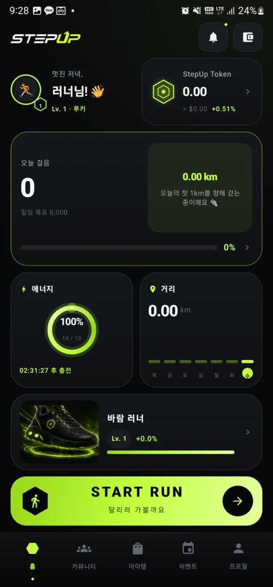
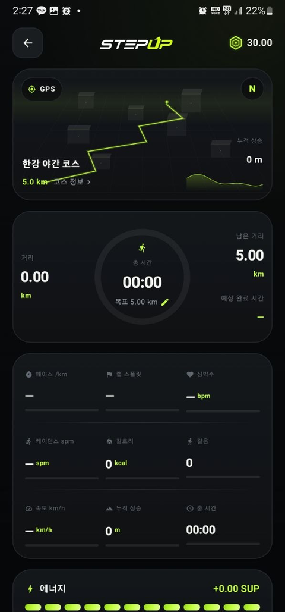
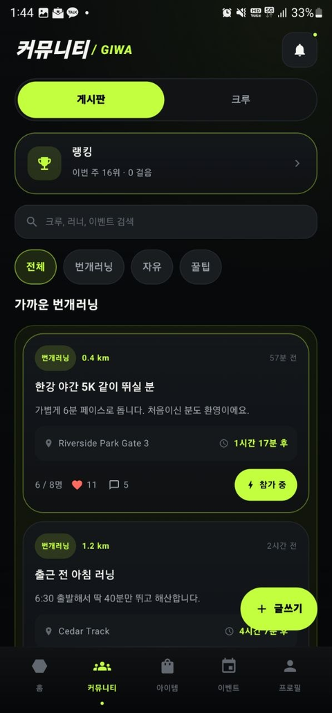
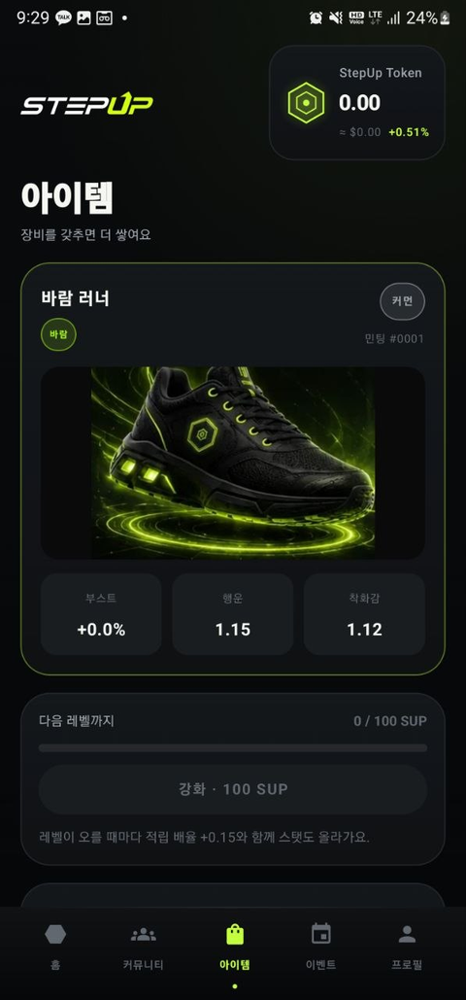
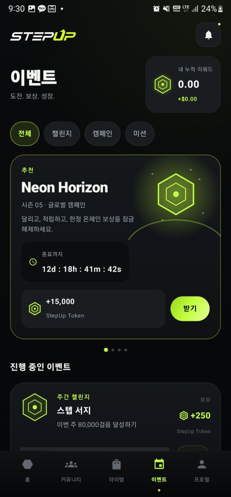
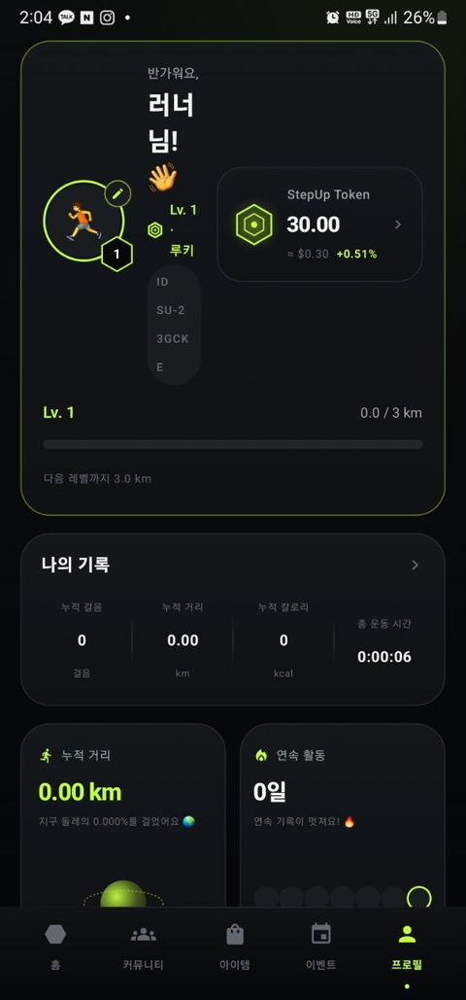

<div align="center">

# StepUp

### Every Step. Every Stride. Every Day.

**A Move-to-Earn (M2E) running app for the [GIWA](https://giwa.io) chain.**
Walk or run in the real world, earn **SUP**, and grow a collection of sneaker NFTs.

[](#)
[](#)
[](#)
[](#)
[](#)

**[⬇️ Download the APK](#-download--try-it)** · [Screenshots](#-screenshots) · [Build from source](#-build-from-source) · [한국어 문서 ↓](#한국어)

📄 **[One-Pager](docs/ONEPAGER.md)** · 🏗️ **[Architecture](docs/ARCHITECTURE.md)** ([PDF](docs/StepUp-Architecture.pdf)) · 💰 **[Tokenomics](docs/TOKENOMICS.md)** · 🎤 **[Pitch Deck](docs/PITCH.md)** · ⛓️ **[Contracts](contracts/)** · 🎬 **[Demo script](docs/DEMO.md)** · 📝 **[Application sheet](docs/APPLICATION.md)** · ✅ **[TODO](docs/TODO-USER.md)** · 🌐 **[Landing page](web/)** · 🔏 **[Attester](attester/)**

</div>

---

## 📌 What is StepUp?

StepUp turns everyday walking and running into an on-chain reward loop.

Most fitness apps stop at a step counter. Most M2E apps stop at a token faucet.
StepUp is built as a **complete consumer app first** — a running tracker, a
sneaker NFT collection, a course-sharing map, a crew community — and then wires
that behaviour to a token economy that GIWA can settle.

| | |
|---|---|
| **Category** | Consumer / SocialFi / Move-to-Earn |
| **Platform** | Native Android (Kotlin + Jetpack Compose) |
| **Chain** | GIWA (target settlement layer for SUP and sneaker NFTs) |
| **Status** | Working app, installable APK, **60+ screens shipped**. On-chain settlement is the next milestone — see the [roadmap](#-roadmap). |
| **Scale today** | 81 Kotlin source files · 665 localized strings × 4 languages · 44 sneaker NFT designs · 100 achievements · 60 runner levels |

### The problem

1. **Fitness apps have no reason to keep you.** Streaks break, the app is deleted.
2. **M2E apps have no reason to exist beyond the token.** When emissions drop, so does the DAU.
3. **Onboarding Web2 users to a chain is brutal.** Seed phrases and gas kill the funnel before the first run.

### What StepUp does about it

1. **The app is worth opening without the token.** GPS course maps, lap splits,
   crew party-runs, flash-run meetups, a 44-piece NFT collection, 100 achievements.
2. **Emissions are capped and honest.** Rewards accrue *only* during an active
   run session, *only* while energy remains, and sneaker boosts top out at ~+18%
   so whales cannot outfarm newcomers. See [Token economy](#-token-economy-sup).
3. **Chain complexity is deferred, not dumped on the user.** SUP is earned and
   spent locally from the first second; the GIWA wallet is something you connect
   when you want to withdraw, not something you fight before your first step.

---

## 📥 Download & try it

**Direct APK (latest CI build):**

```
https://github.com/mycyi1994-hash/GIWASTEPN/raw/apk-dist/StepUp-debug.apk
```

Or with `curl`:

```bash
curl -L -o StepUp.apk \
  https://github.com/mycyi1994-hash/GIWASTEPN/raw/apk-dist/StepUp-debug.apk
```

**Install on an Android phone (API 26+ / Android 8.0+):**

1. Open the link above in the phone's browser and download the `.apk`.
2. Android will ask to allow installs from this source — allow it for the browser.
3. Open the downloaded file and tap **Install**.
4. On first launch, grant **Physical activity** (step counter) and **Location**
   (GPS course tracking). Notifications are optional but recommended.

Every push to the development branch rebuilds the APK through
[GitHub Actions](.github/workflows/build-apk.yml) and force-pushes it to the
[`apk-dist`](../../tree/apk-dist) branch, so the link above is always the newest build.
The workflow also uploads a `StepUp-debug-apk` artifact on each run.

> **Testing without a step sensor?** Emulators usually have no
> `TYPE_STEP_COUNTER`. Debug builds expose a **"+100 steps (debug)"** button on
> the run screen so the whole earn → energy → ledger flow can be exercised.

---

## 📱 Screenshots

| Home | Live run · GPS course | Community |
|:--:|:--:|:--:|
|  |  |  |
| Steps, energy ring, equipped sneaker, one-tap **START RUN** | Real GPS track on a neon course map, goal ring, 9 live metrics, laps | Boards, crews, nearby flash-runs, ranking |

| Items · NFT | Events | Profile |
|:--:|:--:|:--:|
|  |  |  |
| Sneaker NFT collection, minting, upgrades, boost shop | Seasonal campaigns, weekly challenges, referrals | Runner level, lifetime stats, achievements, settings |

---

## ✨ Features

### Run tracking

- **Foreground run session** — `TYPE_STEP_COUNTER` + `LocationManager` GPS in a
  foreground service (`health|location`), survives screen-off and app switching.
- **Real GPS course maps** — coordinates are Haversine-measured, simplified, and
  normalized (with `cos(latitude)` correction so the shape never skews), then
  drawn as a neon track. Start dot, finish flag, live runner dot.
- **Laps** — automatic split at every kilometre plus a manual lap button.
- **Live metrics** — pace/km, lap split, heart rate, cadence (spm), calories,
  steps, speed, elevation gain, elapsed time, projected finish time.

### Courses (create · select · share)

- **코스 선택 / Course picker** — pick a course before a run; the run screen then
  renders your live GPS trace against it.
- **코스 만들기 / Course builder** — record a run, then save the recorded GPS
  track as a named, reusable course.
- **코스 게시판 / Course board** — publish a course so other runners can take it,
  like it, and run it. Like and run counts are tracked per course.
- **Distance-scaled completion rewards** — finishing a course pays
  `distance_km × 1.0 SUP`, capped at 42 SUP (marathon distance). Fully
  deterministic, no random rolls, and it only pays at ≥98% of the course length.
- Seeded with five real Seoul courses (Yeouido 4.68 km, Banpo 4.10 km, Olympic
  Park 3.24 km, Namsan 2.73 km, Seoul Forest 2.26 km).

### Sneaker NFTs — a 44-piece collection

- **4 factions** (🔥 Fire · 💧 Water · ⚡ Lightning · 🌪 Wind)
  × **11 rarity variants** (Common 3 · Rare 3 · Epic 3 · Legendary 2) = **44 designs**.
- Faction sets the colourway and effect, rarity sets the silhouette, ornament and boost.
- **Minting** costs 500 SUP; the Luck stat biases the rarity roll. Each mint gets
  a serial (`#0001`).
- **Boosts are deliberately small** — +1% per rarity tier, +0.3% per variant,
  +0.5% per level. Even a max-rolled Legendary at Lv.30 is only ≈ **+18%**, so
  collecting stays fun without becoming pay-to-farm.
- Comfort reduces energy drain (up to 15%); rarity caps the upgrade level (10–30).

### Runner level — XP from real kilometres

Level is **not** the NFT's level. It is the user's own XP, earned from distance
actually covered.

- 60 levels. Level *n* requires `3.0 + 1.6 × (n−1)` km, so the cumulative
  requirement to Lv.60 is ≈ **2,914.6 km**.
- Titles unlock along the way: Rookie → Strider → Trailblazer → Pacesetter →
  Elite → Master → Legend.

### Community

- **Boards** — flash-run (번개러닝), free talk, and tips, sorted by proximity for
  flash-runs, with category chips and full-text search.
- **Flash-run detail** — meeting place opens in **Google Maps**, participant
  roster, join/leave with live capacity.
- **Comments and replies** — threaded replies (대댓글) generate a notification for
  the parent author.
- **Crews** — join or create a crew, crew-only board, and **party runs**:
  ready-check → 3·2·1 countdown → synchronized measurement → **+10% per crew
  member (max +50%)** applied to the settled SUP.
- **Ranking** — weekly steps and lifetime SUP, with a podium and a full ladder.

### Events, items, profile

- Seasonal campaign (Neon Horizon), weekly challenges wired to real step data,
  referral sharing, and claims that credit real SUP.
- Boost shop (energy cell, streak shield, XP booster) with real purchase and effect.
- Profile with lifetime stats, 100 achievements across 13 categories, monthly
  summary, daily goal, wallet, notification inbox, analytics, and settings.

### Localization

Korean · English · 简体中文 · 日本語 — **665 strings**, fully translated.
Follows the system language by default, and on Android 13+ the in-app
**language setting** (`localeConfig`) can override it per-app. Every user-facing
string is localized; only proper nouns (StepUp, SUP, GIWA) stay fixed.

---

## 💰 Token economy (SUP)

`domain/RewardEconomy.kt` — unit-tested in `app/src/test/`.

| Rule | Value |
|---|---|
| **Base accrual** | `0.01 SUP` per step, **only during an active run session** |
| **Energy gate** | 1 energy cell = 600 rewardable steps. Refills at local midnight. At 0 energy, accrual stops. |
| **Sneaker boost** | rarity **+1%** / variant **+0.3%** / level **+0.5%** → max ≈ **+18%** |
| **Party run** | **+10%** per crew member, capped at **+50%** |
| **Daily goal bonus** | **20 SUP**, plus **+10%** per consecutive day (7-day cap) |
| **Course completion** | `distance_km × 1.0 SUP`, capped at **42 SUP**, paid at ≥98% completion |
| **Sinks** | Minting (500 SUP), upgrades (100 SUP+), boost shop items (50–200 SUP) |

**Design intent.** Every emission is gated by *physical distance actually
covered*, and the multiplier ceiling is low by construction. A brand-new player
with no NFT earns within ~18% of a maxed-out player on the same run — so the
economy is driven by how much people move, not by how much they staked. Sinks
(minting, upgrades, boosts) are priced against that emission rate so SUP has a
reason to leave circulation.

📖 Full model — supply schedule, per-persona balance tables, anti-abuse, and the
open questions we have *not* solved: **[docs/TOKENOMICS.md](docs/TOKENOMICS.md)**

---

## ⛓️ GIWA integration plan

Being precise about what exists today, because reviewers deserve that.
The contracts are written and unit-tested in [`contracts/`](contracts/) —
Solidity 0.8.28, OpenZeppelin 5.x, **43 passing tests** — and target
**GIWA Sepolia** (chain ID 91342). None of them is deployed yet.

| Layer | Today | Next |
|---|---|---|
| **SUP balance** | Local ledger (Room), every accrual and spend recorded as a row | ERC-20 `SUPToken` on GIWA; the local ledger becomes the off-chain accrual buffer |
| **Sneaker NFT** | 44 designs, minting/upgrade/equip fully implemented locally | ERC-721 `SneakerNFT` on GIWA, metadata pinned to IPFS |
| **Reward settlement** | Computed on-device by `RewardEconomy` | `RewardDistributor` contract; the client submits a signed run proof and claims |
| **Courses** | Room, shared in-app | `CourseRegistry` contract so a course and its author are publicly verifiable |
| **Wallet** | Wallet screen with ledger and withdrawal UX in place | GIWA wallet connect + withdraw |

The reward math, the ledger schema, and the wallet UX were all built to be
settled on-chain — the client already produces exactly the per-session
`(steps, distance, boost, payout)` record a distributor contract needs.

---

## ⛓️ Contracts

Solidity 0.8.28 · OpenZeppelin 5.x · Hardhat · **43 passing tests** ·
**live on GIWA Sepolia (91342)** since 2026-07-31

| Deployed | Address |
|---|---|
| `SUPToken` | [`0xb052A8f6…9006c1B`](https://sepolia-explorer.giwa.io/address/0xb052A8f6A5034747902b6d6787bbfF31A9006c1B) |
| `SneakerNFT` | [`0x8174f905…BabEFc960`](https://sepolia-explorer.giwa.io/address/0x8174f905d86438ac8922c85d3A48604BabEFc960) |
| `RewardDistributor` | [`0x9f9E87bD…aCFE36E1`](https://sepolia-explorer.giwa.io/address/0x9f9E87bD825144A8315d30979E3004FbaCFE36E1) |
| `CourseRegistry` | [`0x6c815DF0…C588542`](https://sepolia-explorer.giwa.io/address/0x6c815DF0d8a5CA7CA0487D1AC2f96c0fEC588542) |

The reward pool holds 50,000,000 SUP (5% of supply). Full record:
[`contracts/deployments/giwaSepolia.json`](contracts/deployments/giwaSepolia.json).
The app still settles locally — wiring the client to these contracts is the
next step, and this README will say so plainly until it is done.

| Contract | Standard | What it guarantees |
|---|---|---|
| `SUPToken` | ERC-20 | 1,000,000,000 SUP minted once. **No mint function exists**, so supply can only fall. |
| `SneakerNFT` | ERC-721 | The boost ceiling is `1780 bps` — a `constant`, not a parameter. Stats on-chain, so earning power is verifiable rather than asserted. |
| `RewardDistributor` | — | The attester decides who gets paid; the contract decides how much may exist. Every claim is charged against a halving daily budget, so a compromised signer cannot inflate the token. **No withdraw, sweep or rescue** — SUP leaves only via `claim`, only to a runner. |
| `CourseRegistry` | — | Course authorship is public and permissionless. `rewardFor(distanceM)` is pure: `km × 1.0 SUP`, capped at 42. |

```bash
cd contracts && npm install && npm test
```

Deployment is a six-step walkthrough (wallet → faucet → deploy → verify) in
**[contracts/README.md](contracts/README.md)**.

---

## 🛠 Tech stack

| Layer | Choice |
|---|---|
| Language | Kotlin 2.0.21 |
| UI | Jetpack Compose (BOM 2024.12.01) + Material 3, Navigation Compose |
| Architecture | MVVM + Repository, manual DI (`ServiceLocator`), `StateFlow` throughout |
| Persistence | Room 2.6.1 (KSP) — daily records, sessions, reward ledger, community, courses · DataStore Preferences for settings |
| Sensors | `TYPE_STEP_COUNTER` (midnight/reboot baseline correction) + `LocationManager` GPS |
| Background | Foreground service, `health\|location` type |
| Build | AGP 8.7.3, compileSdk 35, minSdk 26, targetSdk 35 |
| CI | GitHub Actions — unit tests → assembleDebug → signature verification → publish APK |

### Project structure

```
app/src/main/java/com/giwa/strideup/
├── core/            # ServiceLocator (manual DI), AppLocale
├── data/
│   ├── local/       # Room entities, DAOs, database (v6)
│   ├── prefs/       # DataStore — goal, energy, streak, language, selected course
│   └── repo/        # Step, Reward, Sneaker, Community, Crew, Course repositories
├── domain/
│   ├── RewardEconomy.kt   # M2E economy — unit tested
│   ├── Sneaker.kt         # faction × rarity × silhouette × minting
│   ├── RunnerLevel.kt     # user XP from cumulative kilometres (60 levels)
│   ├── RunCourse.kt       # GeoPoint, Haversine, simplify, normalize, rewards
│   └── Community.kt       # posts, categories, ranking
├── sensor/          # StepTracker — step sensor wrapper
├── service/         # WalkSessionService — run session, laps, GPS track
└── ui/
    ├── theme/       # Volt palette, brushes, typography, shapes
    ├── components/  # HexEmblem, NeonRing, GlowCard, CourseTrackMap, SneakerImage
    ├── guide/       # spotlight onboarding tour
    └── screens/     # home · community · items · events · profile · walk · rewards · settings · splash · login
```

---

## 🎨 Design — "Volt"

Pure black canvas, a single neon-lime accent, and softness that comes from
curvature and negative space rather than colour.

| Axis | Rule |
|---|---|
| **Colour** | Deep black `#060708` + Volt lime `#C3FF3E` as the only accent — nothing competes for saturation |
| **Type** | ExtraBold/Black with tight tracking for numbers and headings; wide-tracked uppercase for micro labels |
| **Surface** | Carbon cards (12–32 dp radius) with hairline borders; only the hero card gets a Volt outline |

Signature elements: the hexagon token emblem, the neon progress ring, the glow
route map, the Volt **START RUN** CTA, and the hexagonal level-badge avatar.

Sneaker artwork is composited rather than pasted: each image is exported with a
lifted black point so the backdrop crushes to true black, then given a padded
alpha feather **baked into the file**, so the art dissolves into the card
without ever clipping the shoe itself.

---

## 🔨 Build from source

```bash
git clone https://github.com/mycyi1994-hash/GIWASTEPN.git
cd GIWASTEPN

./gradlew :app:assembleDebug        # debug APK → app/build/outputs/apk/debug/
./gradlew :app:testDebugUnitTest    # economy unit tests
```

Requires JDK 17 and the Android SDK (compileSdk 35). Opening the project in
Android Studio (Ladybug or newer) syncs everything automatically.

### About the committed debug keystore

`app/debug.keystore` is committed on purpose. CI runners are recreated per run,
so AGP's auto-generated debug key would differ on every build — and a differently
signed APK cannot be installed over the previous one
(`INSTALL_FAILED_UPDATE_INCOMPATIBLE`). Pinning the key keeps updates installable
for testers.

This is a standard-issue Android debug key (password `android`) with **no release
authority**. A Play Store build must inject a separate release keystore from CI
secrets. Every CI run verifies that the produced APK's SHA-256 certificate
fingerprint matches this keystore.

---

## 🗺 Roadmap

- [x] Volt design system + 5 tabs + 60 screens
- [x] Foreground run session with step sensor + GPS
- [x] Sneaker NFT collection — 4 factions × 11 variants (44 designs)
- [x] Runner XP level system from cumulative kilometres (60 levels)
- [x] Community boards, crews, party runs, ranking, comments and replies
- [x] Course system — create, select, share, distance-scaled completion rewards
- [x] Localization — Korean / English / Chinese / Japanese, in-app language setting
- [x] **Contracts written and tested** — `SUPToken` (ERC-20), `SneakerNFT` (ERC-721), `RewardDistributor`, `CourseRegistry` — see [`contracts/`](contracts/)
- [ ] **Deploy and source-verify on GIWA Sepolia** (chain ID 91342)
- [ ] **Wallet connect + on-chain SUP withdrawal**
- [ ] Backend for community, ranking and course sharing (currently local + seeded)
- [ ] Sneaker NFT marketplace (trade / rent)
- [ ] Health Connect integration
- [ ] Anti-cheat — GPS plausibility, cadence sanity, server-side run proof

---

<div align="center">

**StepUp** · built for the GIWA ecosystem

</div>

---
---

<a name="한국어"></a>

# StepUp (한국어)

### Every Step. Every Stride. Every Day.

**[GIWA](https://giwa.io) 체인 기반 Move-to-Earn(M2E) 러닝 앱.**
실제로 걷고 달린 만큼 **SUP**를 적립하고, 스니커즈 NFT를 모읍니다.

**[⬇️ APK 내려받기](#-apk-내려받기)** · [스크린샷](#-스크린샷) · [소스 빌드](#-소스에서-빌드하기)

📄 **[원페이저](docs/ONEPAGER.md)** · 🏗️ **[기술 아키텍처](docs/ARCHITECTURE.md)** ([PDF](docs/StepUp-Architecture.pdf)) · 💰 **[토크노믹스](docs/TOKENOMICS.md)** · 🎤 **[피치덱](docs/PITCH.md)** · ⛓️ **[컨트랙트](contracts/)** · 🎬 **[데모 대본](docs/DEMO.md)** · 📝 **[지원서 완본](docs/APPLICATION.md)** · ✅ **[할 일 가이드](docs/TODO-USER.md)** · 🌐 **[랜딩 페이지](web/)** · 🔏 **[어테스터](attester/)**

---

## 📌 StepUp은 무엇인가요

StepUp은 매일의 걷기와 달리기를 온체인 리워드 루프로 바꿉니다.

대부분의 피트니스 앱은 만보기에서 멈추고, 대부분의 M2E 앱은 토큰 수도꼭지에서
멈춥니다. StepUp은 **먼저 완결된 소비자 앱**으로 만들었습니다 — 러닝 트래커,
스니커즈 NFT 컬렉션, 코스 공유 지도, 크루 커뮤니티. 그 위에 GIWA가 정산할 수
있는 토큰 이코노미를 얹었습니다.

| | |
|---|---|
| **분류** | 컨슈머 / SocialFi / Move-to-Earn |
| **플랫폼** | 네이티브 안드로이드 (Kotlin + Jetpack Compose) |
| **체인** | GIWA (SUP·스니커즈 NFT의 정산 레이어) |
| **현재 상태** | 동작하는 앱, 설치 가능한 APK, **60개 이상 화면 완성**. 온체인 정산이 다음 마일스톤입니다 — [로드맵](#-로드맵) 참고 |
| **규모** | Kotlin 81개 파일 · 문자열 665개 × 4개 언어 · 스니커즈 NFT 44종 · 업적 100종 · 러너 레벨 60단계 |

### 문제

1. **피트니스 앱은 남아 있을 이유가 없습니다.** 연속 기록이 끊기면 앱은 지워집니다.
2. **M2E 앱은 토큰 말고는 존재 이유가 없습니다.** 배출이 줄면 DAU도 같이 줄어듭니다.
3. **웹2 유저를 체인에 올리는 일은 가혹합니다.** 시드 구문과 가스비가 첫 러닝 전에 이탈을 만듭니다.

### StepUp의 답

1. **토큰이 없어도 열 만한 앱을 만들었습니다.** GPS 코스맵, 랩 스플릿, 크루
   파티런, 번개러닝, NFT 44종 도감, 업적 100종.
2. **배출은 상한이 있고 정직합니다.** 적립은 러닝 세션 중에만, 에너지가 남아
   있을 때만 발생하고, 스니커즈 부스트 상한은 약 +18%라 고래가 신규 유저를
   압도하지 못합니다. [토큰 이코노미](#-토큰-이코노미-sup) 참고.
3. **체인의 복잡함을 유저에게 떠넘기지 않습니다.** SUP는 첫 순간부터 로컬에서
   적립·소비되고, GIWA 지갑은 출금하고 싶을 때 연결하는 것이지 첫 걸음 전에
   싸워야 하는 관문이 아닙니다.

---

## 📥 APK 내려받기

**최신 CI 빌드 직접 링크:**

```
https://github.com/mycyi1994-hash/GIWASTEPN/raw/apk-dist/StepUp-debug.apk
```

`curl`로 받을 때:

```bash
curl -L -o StepUp.apk \
  https://github.com/mycyi1994-hash/GIWASTEPN/raw/apk-dist/StepUp-debug.apk
```

**안드로이드 폰에 설치 (API 26+ / Android 8.0 이상):**

1. 폰 브라우저로 위 링크를 열어 `.apk`를 내려받습니다.
2. "이 출처의 앱 설치 허용"을 묻습니다 — 브라우저에 허용해 주세요.
3. 내려받은 파일을 열고 **설치**를 누릅니다.
4. 첫 실행 시 **신체 활동**(걸음 센서)과 **위치**(GPS 코스 기록) 권한을
   허용해 주세요. 알림 권한은 선택이지만 켜두는 편이 좋습니다.

개발 브랜치에 푸시될 때마다 [GitHub Actions](.github/workflows/build-apk.yml)가
APK를 다시 빌드해 [`apk-dist`](../../tree/apk-dist) 브랜치에 강제 푸시하므로,
위 링크는 항상 최신 빌드를 가리킵니다. 각 실행마다 `StepUp-debug-apk`
아티팩트도 함께 올라갑니다.

> **걸음 센서가 없는 환경에서 테스트하려면?** 에뮬레이터에는 보통
> `TYPE_STEP_COUNTER`가 없습니다. 디버그 빌드의 러닝 화면에 있는
> **"+100 걸음 (디버그)"** 버튼으로 적립 → 에너지 → 원장 흐름을 모두 확인할 수 있습니다.

---

## 📱 스크린샷

| 홈 | 러닝 세션 · GPS 코스 | 커뮤니티 |
|:--:|:--:|:--:|
|  |  |  |
| 걸음, 에너지 링, 착용 스니커즈, 원탭 **START RUN** | 네온 코스맵 위 실제 GPS 경로, 목표 링, 실시간 지표 9종, 랩 | 게시판, 크루, 가까운 번개러닝, 랭킹 |

| 아이템 · NFT | 이벤트 | 프로필 |
|:--:|:--:|:--:|
|  |  |  |
| 스니커즈 NFT 도감, 민팅, 강화, 부스트 상점 | 시즌 캠페인, 주간 챌린지, 친구 초대 | 러너 레벨, 누적 통계, 업적, 설정 |

---

## ✨ 기능

### 러닝 측정

- **포그라운드 러닝 세션** — `TYPE_STEP_COUNTER` + `LocationManager` GPS를
  포그라운드 서비스(`health|location`)에서 돌립니다. 화면을 꺼도, 앱을 전환해도
  측정이 이어집니다.
- **실제 GPS 코스맵** — 좌표를 하버사인으로 재고, 솎아내고, `cos(위도)` 보정을
  넣어 정규화해서(모양이 찌그러지지 않습니다) 네온 경로로 그립니다. 시작점,
  도착 깃발, 실시간 러너 점까지 표시합니다.
- **랩** — 1 km마다 자동 분할 + 수동 랩 버튼.
- **실시간 지표** — 페이스/km, 랩 스플릿, 심박수, 케이던스(spm), 칼로리, 걸음,
  속도, 누적 상승, 총 시간, 예상 완료 시간.

### 코스 (만들기 · 선택 · 공유)

- **코스 선택** — 러닝 전에 코스를 고르면, 러닝 화면이 그 코스 위에 내 실시간
  GPS 경로를 겹쳐 보여줍니다.
- **코스 만들기** — 달린 뒤 기록된 GPS 경로를 이름 붙여 재사용 가능한 코스로
  저장합니다.
- **코스 게시판** — 코스를 공유하면 다른 러너가 가져가 달릴 수 있습니다.
  코스별 좋아요·완주 횟수가 집계됩니다.
- **거리별 정량 완주 보상** — 완주하면 `거리(km) × 1.0 SUP`, 최대 42 SUP
  (마라톤 거리). 확률 없이 완전히 결정적이며, 코스 길이의 98% 이상을 달성해야
  지급됩니다.
- 실제 서울 코스 5개가 기본 제공됩니다(여의도 4.68 km, 반포 4.10 km,
  올림픽공원 3.24 km, 남산 2.73 km, 서울숲 2.26 km).

### 스니커즈 NFT — 44종 도감

- **속성 4종**(🔥 불 · 💧 물 · ⚡ 번개 · 🌪 바람)
  × **등급 변형 11종**(Common 3 · Rare 3 · Epic 3 · Legendary 2) = **총 44종**.
- 속성이 색과 이펙트를, 등급이 실루엣·오너먼트·부스트를 정합니다.
- **민팅**은 500 SUP이며, 행운 스탯이 등급 확률을 보정합니다. 민팅마다 고유
  번호(`#0001`)가 부여됩니다.
- **부스트는 의도적으로 작습니다** — 등급 +1%, 변형 +0.3%, 레벨 +0.5%. 최고
  조합(전설 · Lv.30)이라도 약 **+18%**라서, 수집의 재미가 파밍 격차로 기울지
  않습니다.
- 착화감은 에너지 소모를 최대 15% 줄이고, 등급이 최대 강화 레벨(10~30)을 정합니다.

### 러너 레벨 — 실제 킬로미터가 경험치

레벨은 **NFT의 레벨이 아니라** 유저 본인의 경험치입니다. 실제로 이동한 거리로만
오릅니다.

- 60레벨. *n*레벨에 필요한 거리는 `3.0 + 1.6 × (n−1)` km이며, Lv.60까지 누적
  약 **2,914.6 km**입니다.
- 진행하며 칭호가 열립니다: Rookie → Strider → Trailblazer → Pacesetter →
  Elite → Master → Legend.

### 커뮤니티

- **게시판** — 번개러닝·자유·꿀팁. 번개러닝은 가까운 순으로 정렬되고, 카테고리
  칩 필터와 전문 검색을 지원합니다.
- **번개러닝 상세** — 집결지를 누르면 **구글 지도**로 연결되고, 참가자 명단과
  실시간 정원 반영 참가/취소가 있습니다.
- **댓글과 대댓글** — 대댓글이 달리면 원 댓글 작성자에게 알림이 갑니다.
- **크루** — 가입하거나 직접 만들고, 크루 전용 게시판과 **파티런**을 씁니다.
  레디체크 → 3·2·1 카운트다운 → 동시 측정 → **크루원 1명당 +10%(최대 +50%)**가
  정산 SUP에 반영됩니다.
- **랭킹** — 주간 걸음과 누적 SUP 두 기준, 시상대와 전체 순위.

### 이벤트 · 아이템 · 프로필

- 시즌 캠페인(Neon Horizon), 실제 걸음 데이터와 연동된 주간 챌린지, 친구 초대
  공유, 실제 SUP가 적립되는 보상 수령.
- 부스트 상점(에너지 셀, 스트릭 실드, XP 부스터) — 실제 구매·적용됩니다.
- 프로필에 누적 통계, 13개 카테고리 업적 100종, 이번 달 요약, 일일 목표, 지갑,
  알림함, 통계, 설정이 모두 들어 있습니다.

### 다국어

한국어 · English · 简体中文 · 日本語 — **문자열 665개** 전부 번역했습니다.
기본은 시스템 언어를 따르고, Android 13+에서는 앱 내 **언어 설정**
(`localeConfig`)으로 앱만 따로 바꿀 수 있습니다. 고유명사(StepUp, SUP, GIWA)를
제외한 모든 노출 문자열이 현지화되어 있습니다.

---

## 💰 토큰 이코노미 (SUP)

`domain/RewardEconomy.kt` — `app/src/test/`에서 단위 테스트로 검증합니다.

| 규칙 | 값 |
|---|---|
| **기본 적립** | 1보당 `0.01 SUP`, **러닝 세션 중에만** |
| **에너지 게이트** | 1칸 = 적립 가능 600보. 매일 자정 리필. 0이 되면 적립 중단 |
| **스니커즈 부스트** | 등급 **+1%** / 변형 **+0.3%** / 레벨 **+0.5%** → 최대 약 **+18%** |
| **파티런** | 크루원 1명당 **+10%**, 최대 **+50%** |
| **일일 목표 보너스** | **20 SUP** + 연속 달성일당 **+10%**(최대 7일) |
| **코스 완주** | `거리(km) × 1.0 SUP`, 최대 **42 SUP**, 98% 이상 완주 시 지급 |
| **소각처** | 민팅(500 SUP), 강화(100 SUP~), 부스트 상점(50~200 SUP) |

**설계 의도.** 모든 배출은 *실제로 이동한 거리*에 묶여 있고, 배율 상한은 구조적으로
낮습니다. NFT가 없는 신규 유저도 같은 러닝에서 만렙 유저 대비 약 18% 이내로
적립합니다 — 즉 이코노미를 움직이는 것은 예치 규모가 아니라 사람들이 실제로
얼마나 움직였는가입니다. 소각처(민팅·강화·부스트)는 이 배출량에 맞춰 가격을
잡아, SUP가 유통에서 빠져나갈 이유를 만듭니다.

📖 전체 모델 — 공급 스케줄, 페르소나별 밸런스 표, 어뷰징 방지, 그리고 아직
**해결하지 못한** 과제들: **[docs/TOKENOMICS.md](docs/TOKENOMICS.md)**

---

## ⛓️ GIWA 연동 계획

심사자에게는 정확한 정보가 필요하므로, 지금 있는 것과 다음에 만들 것을 나눠
적습니다. 컨트랙트는 [`contracts/`](contracts/)에 작성·단위 테스트까지 되어
있습니다 — Solidity 0.8.28, OpenZeppelin 5.x, **테스트 43개 통과** —
대상 체인은 **GIWA Sepolia**(체인 ID 91342)입니다. 아직 배포된 것은 없습니다.

| 레이어 | 현재 | 다음 |
|---|---|---|
| **SUP 잔액** | 로컬 원장(Room) — 모든 적립·사용이 한 줄씩 기록 | GIWA 위 ERC-20 `SUPToken`, 로컬 원장은 오프체인 적립 버퍼로 전환 |
| **스니커즈 NFT** | 44종, 민팅·강화·착용 로컬 완전 구현 | GIWA 위 ERC-721 `SneakerNFT`, 메타데이터 IPFS 고정 |
| **리워드 정산** | 기기에서 `RewardEconomy`가 계산 | `RewardDistributor` 컨트랙트 — 클라이언트가 서명된 러닝 증명을 제출해 청구 |
| **코스** | Room 저장, 앱 내 공유 | `CourseRegistry` 컨트랙트 — 코스와 작성자를 공개 검증 가능하게 |
| **지갑** | 원장·출금 UX가 들어간 지갑 화면 | GIWA 지갑 연결 + 출금 |

리워드 계산, 원장 스키마, 지갑 UX 모두 온체인 정산을 전제로 만들었습니다.
클라이언트는 이미 분배 컨트랙트가 필요로 하는 세션별
`(걸음, 거리, 부스트, 지급액)` 레코드를 그대로 생성하고 있습니다.

---

## ⛓️ 컨트랙트

Solidity 0.8.28 · OpenZeppelin 5.x · Hardhat · **테스트 43개 통과** ·
2026-07-31 **GIWA Sepolia (91342) 배포 완료**

| 배포된 컨트랙트 | 주소 |
|---|---|
| `SUPToken` | [`0xb052A8f6…9006c1B`](https://sepolia-explorer.giwa.io/address/0xb052A8f6A5034747902b6d6787bbfF31A9006c1B) |
| `SneakerNFT` | [`0x8174f905…BabEFc960`](https://sepolia-explorer.giwa.io/address/0x8174f905d86438ac8922c85d3A48604BabEFc960) |
| `RewardDistributor` | [`0x9f9E87bD…aCFE36E1`](https://sepolia-explorer.giwa.io/address/0x9f9E87bD825144A8315d30979E3004FbaCFE36E1) |
| `CourseRegistry` | [`0x6c815DF0…C588542`](https://sepolia-explorer.giwa.io/address/0x6c815DF0d8a5CA7CA0487D1AC2f96c0fEC588542) |

리워드 풀에 5천만 SUP(전체 공급의 5%)가 들어가 있습니다. 전체 기록은
[`contracts/deployments/giwaSepolia.json`](contracts/deployments/giwaSepolia.json).
**앱은 아직 로컬에서 정산합니다.** 클라이언트를 이 컨트랙트에 붙이는 것이 다음
단계이고, 끝나기 전까지 이 README는 그 사실을 그대로 적어 둡니다.

| 컨트랙트 | 표준 | 보장하는 것 |
|---|---|---|
| `SUPToken` | ERC-20 | 10억 SUP를 한 번만 발행. **발행 함수가 존재하지 않아** 공급은 줄어들기만 합니다. |
| `SneakerNFT` | ERC-721 | 부스트 천장이 `1780 bps` — 파라미터가 아니라 `constant`입니다. 스탯이 온체인이라 적립 능력을 주장이 아니라 검증할 수 있습니다. |
| `RewardDistributor` | — | 누구에게 줄지는 어테스터가, 얼마나 존재할 수 있는지는 컨트랙트가 정합니다. 모든 청구가 반감하는 일일 예산에서 차감되므로 서명 키가 털려도 토큰은 인플레이션되지 않습니다. **withdraw·sweep·rescue 없음** — SUP는 `claim`으로 러너에게만 나갑니다. |
| `CourseRegistry` | — | 코스 작성은 누구나, 기록은 공개. `rewardFor(distanceM)`은 순수 함수 — `km × 1.0 SUP`, 최대 42. |

```bash
cd contracts && npm install && npm test
```

지갑 → 파우셋 → 배포 → 검증까지 6단계 안내는
**[contracts/README.md](contracts/README.md)** 에 있습니다.

---

## 🛠 기술 스택

| 레이어 | 선택 |
|---|---|
| 언어 | Kotlin 2.0.21 |
| UI | Jetpack Compose (BOM 2024.12.01) + Material 3, Navigation Compose |
| 아키텍처 | MVVM + Repository, 수동 DI(`ServiceLocator`), 전 구간 `StateFlow` |
| 저장소 | Room 2.6.1 (KSP) — 일별 기록·세션·리워드 원장·커뮤니티·코스 · 설정은 DataStore |
| 센서 | `TYPE_STEP_COUNTER`(자정/재부팅 기준점 보정) + `LocationManager` GPS |
| 백그라운드 | 포그라운드 서비스, `health\|location` 타입 |
| 빌드 | AGP 8.7.3, compileSdk 35, minSdk 26, targetSdk 35 |
| CI | GitHub Actions — 단위 테스트 → assembleDebug → 서명 검증 → APK 배포 |

프로젝트 구조는 [영문 섹션](#project-structure)과 동일합니다.

---

## 🎨 디자인 — "Volt"

퓨어 블랙 캔버스에 네온 라임 단일 강조. 부드러움은 색이 아니라 큰 곡률과 여백에서
나옵니다.

| 축 | 규칙 |
|---|---|
| **색** | 딥 블랙 `#060708` + 볼트 라임 `#C3FF3E` 단일 강조 — 채도 경쟁자를 두지 않는다 |
| **획** | 큰 숫자·제목은 ExtraBold/Black + 타이트한 자간, 소형 라벨은 넓은 자간 대문자 |
| **면** | 카본 카드(12~32dp 곡률) + 헤어라인. 히어로 카드만 볼트 외곽선 |

시그니처 요소: 헥사곤 토큰 엠블럼, 네온 진행 링, 글로우 루트 맵,
볼트 **START RUN** CTA, 육각 레벨 배지 아바타.

스니커즈 아트는 붙여넣은 이미지가 아니라 합성됩니다. 각 이미지는 블랙 포인트를
올려 배경을 완전한 검정으로 눌러 내보내고, 여백에만 알파 페더를 **파일에 구워
넣었습니다.** 그래서 신발 원형은 절대 잘리지 않으면서 아트가 카드에 자연스럽게
녹아듭니다.

---

## 🔨 소스에서 빌드하기

```bash
git clone https://github.com/mycyi1994-hash/GIWASTEPN.git
cd GIWASTEPN

./gradlew :app:assembleDebug        # 디버그 APK → app/build/outputs/apk/debug/
./gradlew :app:testDebugUnitTest    # 이코노미 단위 테스트
```

JDK 17과 Android SDK(compileSdk 35)가 필요합니다. Android Studio
(Ladybug 이상)에서 열면 자동으로 동기화됩니다.

### 저장소에 포함된 debug 키스토어에 대해

`app/debug.keystore`는 의도적으로 커밋했습니다. CI 러너는 실행마다 새로
만들어지므로 AGP가 자동 생성하는 debug 키에 맡기면 **빌드마다 서명이 달라지고**,
서명이 다른 APK는 기존 앱 위에 설치할 수 없습니다
(`INSTALL_FAILED_UPDATE_INCOMPATIBLE`). 키를 고정해야 테스터가 계속 업데이트할 수
있습니다.

이는 표준 안드로이드 debug 키(비밀번호 `android`)이며 **배포 권한이 없습니다.**
플레이 스토어 출시에는 별도 release 키스토어를 CI 시크릿으로 주입해야 합니다.
CI는 매 빌드마다 APK의 SHA-256 인증서 지문이 이 키스토어와 일치하는지 검증합니다.

---

## 🗺 로드맵

- [x] Volt 디자인 시스템 + 5탭 + 60개 화면
- [x] 걸음 센서 + GPS 포그라운드 러닝 세션
- [x] 스니커즈 NFT 도감 — 4속성 × 11변형 (44종)
- [x] 누적 킬로미터 기반 러너 경험치 레벨 (60단계)
- [x] 커뮤니티 게시판·크루·파티런·랭킹·댓글/대댓글
- [x] 코스 시스템 — 만들기·선택·공유, 거리별 정량 완주 보상
- [x] 다국어 — 한국어/영어/중국어/일본어, 앱 내 언어 설정
- [x] **컨트랙트 작성·테스트 완료** — `SUPToken`(ERC-20), `SneakerNFT`(ERC-721), `RewardDistributor`, `CourseRegistry` — [`contracts/`](contracts/)
- [ ] **GIWA Sepolia 배포 및 소스 검증** (체인 ID 91342)
- [ ] **지갑 연결 + 온체인 SUP 출금**
- [ ] 커뮤니티·랭킹·코스 공유 백엔드 (현재는 로컬 + 시드 데이터)
- [ ] 스니커즈 NFT 마켓 (거래 / 임대)
- [ ] Health Connect 연동
- [ ] 어뷰징 방지 — GPS 타당성, 케이던스 정합성, 서버 측 러닝 증명

---

<div align="center">

**StepUp** · GIWA 생태계를 위해 만들었습니다

</div>
